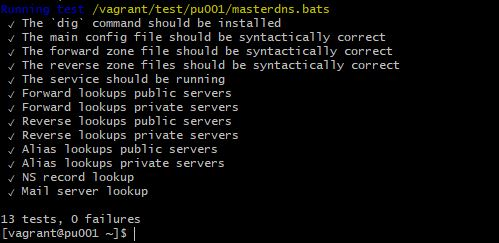
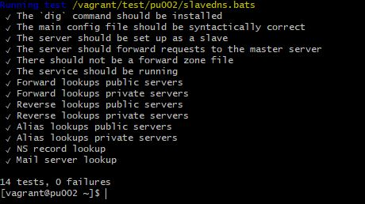

# Enterprise Linux Lab Report

- Student name: Robin Roelandt
- Github repo: <https://github.com/RobinRoelandt/elnx-sme>

## Doel van de taak

- Installeren van master en slave DNS
- Configureren van master en slave DNS

## Test plan

Er zijn voor deze servers geautomatiseerde tests voorzien. De werking kan dus getest worden door de tests uit te voeren op de servers.

## Procedure/Documentation

De vereiste rollen worden aangevuld in het [site.yml](https://github.com/RobinRoelandt/elnx-sme/blob/master/ansible/site.yml) bestand en de configuratie is te vinden in het [pu001.yml](https://github.com/RobinRoelandt/elnx-sme/blob/master/ansible/host_vars/pu004.yml)
en in het [pu002.yml](https://github.com/RobinRoelandt/elnx-sme/blob/master/ansible/host_vars/pu004.yml) bestand.

Hier wordt gedefinieërd welke services de firewall door moet laten, in dit geval moeten DNS requests doorgelaten worden.

De naam van de DNS zone is aangepast naar avalon.lan en het ip van de master DNS server is ```192.0.2.10```

Bij ```bind_zone_networks``` worden de netwerken gedefinieërd waar de server een DNS record voor dient te voorzien. In dit geval is dat voor de netwerken ```192.0.2, 172.16, 10```.

De ```bind_zone_name_servers``` definiëren welke servers in het netwerk de DNS services voorzien.

De DNS records worden gedeclareerd bij ```bind_zone_hosts```

Eventuele mailservers kunnen toegewezen worden bij ```bind_zone_mail_servers```

De regel ```bind_allow_query``` zorgt ervoor dat de server antwoord op DNS-query's die gestuurd worden door andere servers of clients in het netwerk, en ```bind_listen_ipv4``` zorgt ervoor dat dit enkel gebeurt op query's die verstuurd worden onder IPv4.


## Test report

Om de opstelling te testen kunnen we de host pu001 en pu002 aanmaken (dit kan met het commando: ```vagrant up pu001 pu002```). Na het voltooien van de installatie kunnen we wederom connecteren met de server door het commando ```vagrant ssh pu001``` en voeren we de tests uit (met het commando: ```sudo /vagrant/test/runbats.sh```). Herhaal de connectie en het uitvoeren van de tests voor server pu002.





## Resources

- [rhbase](https://github.com/bertvv/ansible-role-rh-base)
- [bind](https://github.com/bertvv/ansible-role-bind)
