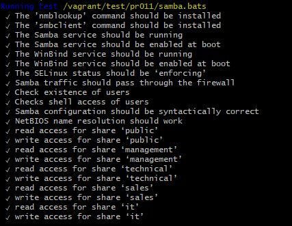
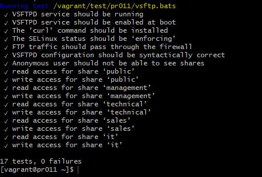

# Enterprise Linux Lab Report

- Student name: Robin Roelandt
- Github repo: <https://github.com/RobinRoelandt/elnx-sme>

## Doel van de taak

- Aanmaken van accounts voor alle werknemers
- Aanmaken shares samba
- Aanmaken shares VSFTPD
- Toekennen correcte lees-en schrijfrechten aan de verschillende shares.

## Test plan

Deze opstelling kan getest worden met de geautomatiseerde tests of door met een FTP client vanop het hostsysteem te verbinden met de server via het ip 172.16.0.11. Als gebruiker kan elk account gebruikt worden om zich aan te melden met de FTP client.

## Procedure/Documentation

De vereiste rollen worden aangevuld in het [site.yml](https://github.com/RobinRoelandt/elnx-sme/blob/master/ansible/site.yml) bestand en de configuratie is te vinden in het [pr011.yml](https://github.com/RobinRoelandt/elnx-sme/blob/master/ansible/host_vars/pr011.yml) bestand.

De firewall laat de correcte services door, in dit geval is dit samba, ftp, tffp en tftp-client.

Er diende een ``samba_workgroup`` aangemaakt te worden en deze kreeg de naam AVALON. Hierna werden nog verschillende parameters aangevuld volgens de specificatie van de opdracht.

Voor het regelen van de rechten op de verschillende shares is er per dienst in het bedrijf een gebruikersgroep aangemaakt waar de correcte gebruikers lid van zijn gemaakt.

Bij ``samba_users`` wordt alle gebruikers die een account hebben op de server een account op de samba service toegewezen.
``samba_shares`` creëert de correcte samba shares en geeft de correcte rechten aan de benodigde gebruikersgroepen.

De VSFTPD parameters zorgen ervoor dat het onmogelijk is om anoniem in te loggen op de server en declareerd de gepaste locatie waar de gebruiker terecht komt na het aanmelden.

In het [site.yml](ansible/site.yml) bestand zijn enkele ACL's te vinden. Deze dienen om de gebruikers toegang te geven tot shares terwijl ze geen lid zijn van de correcte gebruikersgroep.

## Test report

De server wordt aangemaakt (met het commando ``vagrant up pr011``) en kan er is ingelogd (met het commando ``vagrant ssh pr011``). De geautomatiseerde tests kunnen uitgevoerd worden met het commando ``sudo /vagrant/test/runbats.sh``

De werking van de server werd ook getest met de FTP client Filezilla.

## Resources

- [rhbase](https://github.com/bertvv/ansible-role-rh-base)
- [Aanmaken ACL's](http://docs.ansible.com/ansible/latest/acl_module.html)
- [Samba](https://github.com/bertvv/ansible-role-samba)
- [VSFTPD](https://github.com/bertvv/ansible-role-vsftpd?files=1)
