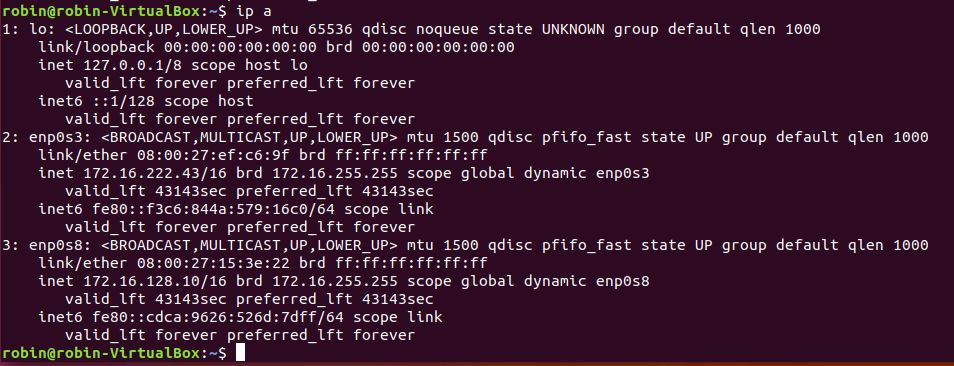

# Enterprise Linux Lab Report

- Student name: Robin Roelandt
- Github repo: <https://github.com/RobinRoelandt/elnx-sme>

## Doel van de taak

Een server opzetten met behulp van ansible die ervoor zorgt dat clients die aangesloten zijn op het netwerk dynamisch een IP adres of een gereserveerd IP-adres (op basis van het MAC-adres) toegewezen krijgen.

## Test plan

Voor deze server zijn er geen automatische tests voorzien, dus dient de werking van de server handmatig gecontroleerd te worden.
Hiervoor dient een nieuwe virtuele machine aangemaakt te worden in Virtualbox en dient men op deze machine Ubuntu te installeren.
Na het succesvol installeren van Ubuntu past u de netwerkadapters van de virtuele machine aan en zorgt u ervoor dat er 2 host-only adapters voorzien zijn met als netwerkinstellingen 172.16.0.0 255.255.0.0.

Noteer het MAC van 1 van de adapters en voeg dit toe aan de ansible configuratie en laat het script nogmaals runnen op de server.

Start na het succesvol aflopen van het script de virtuele machine opnieuw op en verifieer dat er een IP-adres is uitgedeeld in de correcte range en dat het gereserveerde IP correct is via het commando ``ip a`` in de terminal.
(De range van IP-adressen die uitgedeeld morgen worden is: 172.16.192.1 tot 172.16.255.253)

## Procedure/Documentation

De vereiste rollen worden aangevuld in het [site.yml](https://github.com/RobinRoelandt/elnx-sme/blob/master/ansible/site.yml) bestand en de configuratie van deze rollen is te vinden in [pu001.yml](https://github.com/RobinRoelandt/elnx-sme/blob/master/ansible/host_vars/pr001.yml)

In dit bestand wordt gedefinieerd welke services de firewall door moet laten, in dit geval moet DHCP-verkeer doorgelaten worden.

De maximale tijd dat een host hetzelfde IP mag behouden zonder opnieuw te onderhandelen met de server is 12 uur en dit wordt gedefinieerd door de parameter ``dhcp_global_max_lease_time``

``dhcp_global_subnet_mask`` zorgt ervoor dat de correcte subnetmask aan DHCP wordt doorgegeven.

``dhcp_global_routers`` zorgt ervoor dat de service weet waar het de router kan vinden van dit netwerk.

De naam avalon.lan wordt meegegeven via de parameter ``dhcp_global_domain_name``

Subnet declaraties kunnen gebeuren onder ``dhcp_subnets`` en het reserveren van IP-adressen voor bepaalde hosts kan via ``dhcp_hosts``

Deze server is niet zonder moeilijkheden opgesteld. Zo liep ik tegen verschillende fouten aan waarover dan een [troubleshooting rapport](rapport-troubleshooting-DHCP.md) is bijgevoegd in het project.

## Test report

Om de opstelling te kunnen testen maken we de server pr001 aan (dit kan met het commando ``vagrant up pr001``). Na het voltooien van de installatie, booten we de client die geïnstalleerd is tijdens het testplan en openen we op deze VM een terminal. Met het commando ``ip a`` kan u controleren of de IP's de verwachte waarden hebben en zo de werking van DHCP verifiëren.

## Resources

- [rhbase](https://github.com/bertvv/ansible-role-rh-base)
- [dhcp](https://github.com/bertvv/ansible-role-dhcp)
