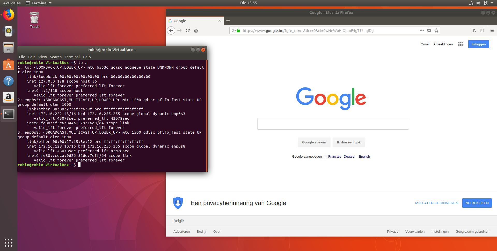
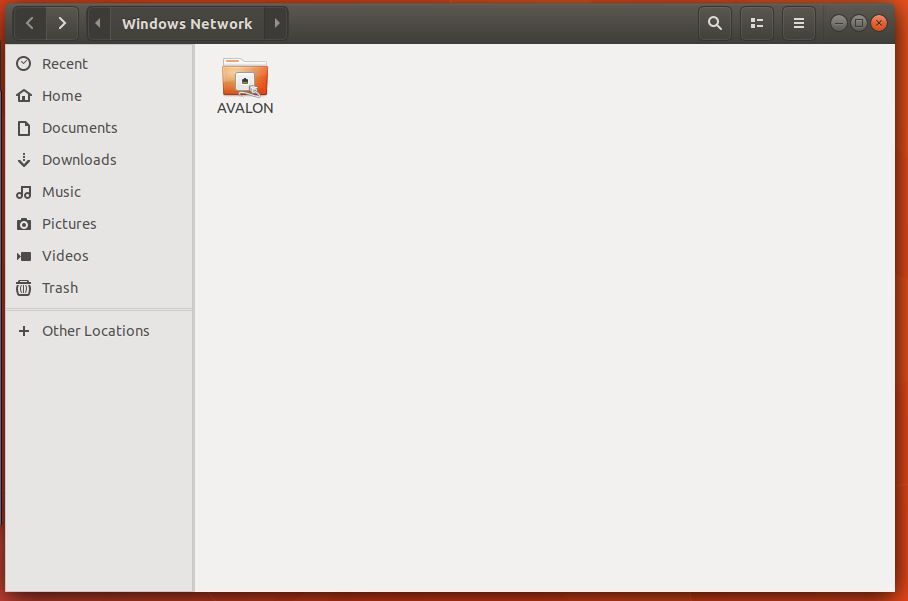

# Enterprise Linux Lab Report

- Student name: Robin Roelandt
- Github repo: <https://github.com/RobinRoelandt/elnx-sme>

## Testen van de geïmplementeerde services op een client in het netwerk

- IP

- Internettoegang

- Fileserver

